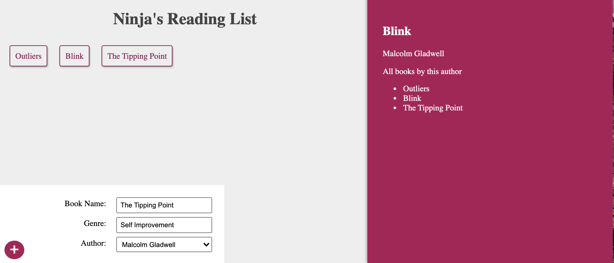

# graphql-booklist

A book list app using GraphQL. The app renders all of the book list when it opens. You can do a mutation to add a book. Once a new book is added, the useEffect will render get all the books again. You can click on a book and a single book query is made.



|                                         |                                         |                                                   |
| :-------------------------------------: | :-------------------------------------: | :-----------------------------------------------: |
|    [Introduction](#graphql-booklist)    | [Table of Contents](#table-of-contents) | [Development Highlights](#development-highlights) |
|      [Installation](#installation)      |    [Page Directory](#page-directory)    |       [Code Hightlights](#code-highlights)        |
| [Technologies Used](#Technologies-Used) |           [Credits](#Credits)           |                [License](#License)                |

## Development Highlights

- Use GraphQL with Express on the back end and React on the front end.
- Use MongoDB Atlas to store data on the cloud.
- Create queries and mutations on GraphQL.

## Installation

```
npm i
npm start
```

## Page Directory

The GraphQL schema is in a schema folder in the server folder. The front end queries for GraphQL is inside a queries folder under src.

## Code Highlights

Add book mutation where you have the variables defined first and then pass in the variables as a parameter.

```JavaScript
const ADD_BOOK_MUTATION = gql`
    mutation
        addBook($name: String!, $genre: String!, $authorId: String!){
            addBook(name: $name, genre: $genre, authorId: $authorId){
                name
                id
            }
        }

`
```

Defining the book type and nesting the author type inside. The author resolves with a findByID MongoDB method so you can return data relating to the author.

```JavaScript
const BookType = new GraphQLObjectType({
    name: 'Book',
    fields: () => ({
        id: { type: GraphQLID },
        name: { type: GraphQLString },
        genre: { type: GraphQLString },
        author: {
            type: AuthorType,
            resolve(parent, args) {
                return Author.findById(parent.authorId);
            }
        }
    })
});
```

## Technologies

### Frontend

- [JavaScript](https://www.javascript.com/)
- [CSS](https://www.w3schools.com/css/)

### Frontend Framework/Library

- [ReactJS](https://reactjs.org/)

### Backend

- [Node.js](https://nodejs.org/en/)

### Backend Framework

- [Express.js](https://expressjs.com/)

### GraphQL

- [graphql](https://graphql.org/)

### Database

- [MongoDB](https://www.mongodb.com/)

## Credits

This project was apart of the [The Net Ninja](https://www.youtube.com/watch?v=Y0lDGjwRYKw&list=PL4cUxeGkcC9iK6Qhn-QLcXCXPQUov1U7f) tutorial.

|                           |                                                                                                                                                                                                       |
| ------------------------- | ----------------------------------------------------------------------------------------------------------------------------------------------------------------------------------------------------- |
| **David Anusontarangkul** | [ LinkedIn](https://www.linkedin.com/in/anusontarangkul/) [ GitHub](https://github.com/anusontarangkul) |

## License

[](https://opensource.org/licenses/MIT)
